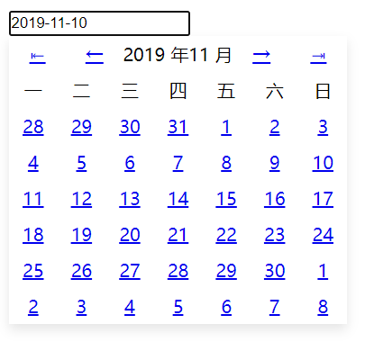

# 基于 Svelte 的 Date Picker

使用见 [dist/index.html](dist/index.html)。__Demo 性质__。



## 构建 

```sh

$ npm install -g yarn
$ yarn
$ yarn build # or `yarn serve` 启动开发

```

## 特性

- 6x7 的日期选择。
- 简单的动画效果。
- 通过 change 事件回调。
- 无外部依赖。

## 其他

MIT 协议。
